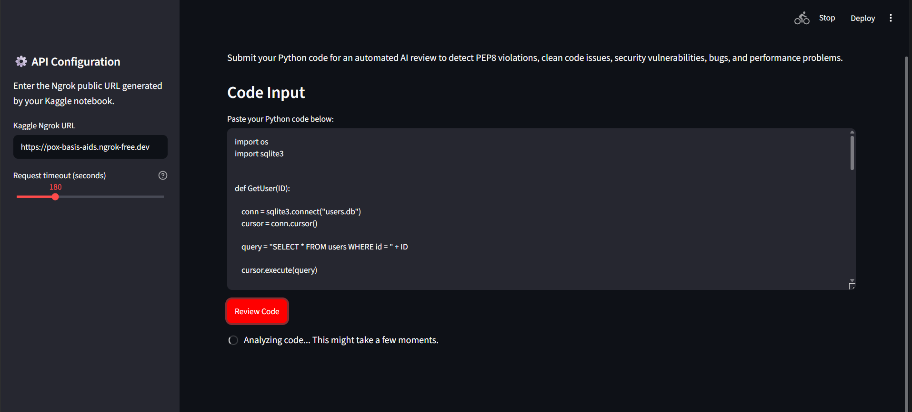
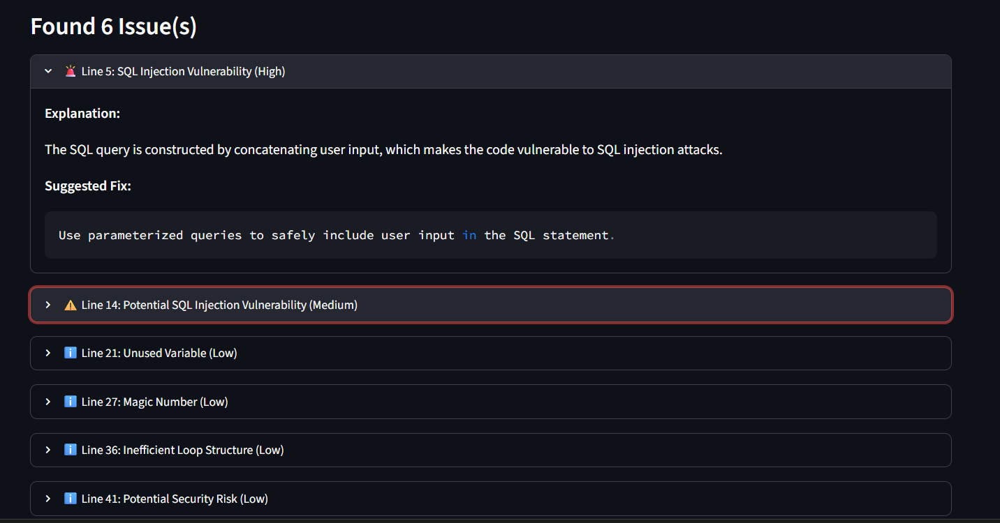

# 🚀 [Tips Hindawi](https://www.tipshindawi.com/) Challenge (June–July) 2026

> 🏆 This repository is my official submission for the [ **Tips Hindawi** ](https://www.tipshindawi.com/) **Challenge (June–July) 2026**.

## 👤 Participant

| Field            | Value                                |
| ---------------- | ------------------------------------ |
| Full Name        | Yassin Ayman El-Sayed Harraz         |
| Project Name     | AiCodeReviewer                       |
| GitHub Username  | [yassinharraz](https://github.com/yassinharraz) |
| Challenge Batch  | June–July 2026                       |
| Training Program | Large Language Models (LLMs) Program |
| Organization     | [**Edrak for Ai**](https://edrak4ai.com/en) |

---

Here are the steps:

1) Go to Kaggle and create a new notebook.
2) Enable GPU: Settings → Accelerator → GPU.
3) Download the cheatsheet files (PEP 8, Clean Code, OWASP) from the repo's knowledge-base folder.
4) In Kaggle, click Add Data → Upload, and upload the cheatsheets so they're available as an input dataset.
5) Upload/paste the AiCodeReviewer notebook code into Kaggle and in CELL 4 change the path to your path.
6) Run all cells — this builds the FAISS vector store from the cheatsheets and loads the Qwen model, confirming the full RAG pipeline works.
7) On your local machine, clone the repo:
```
git clone https://github.com/yassinharraz/AiCodeReviewer.git
cd AiCodeReviewer
```
8) Install dependencies:
```
pip install -r requirements.txt
```
9) Place the cheatsheet files (and any saved FAISS index from Kaggle) in the same relative folder the code expects.
10) Launch the Streamlit app locally:
```
streamlit run ui.py
```
11) Open the app in your browser, upload Python files, and take public URL and paste it in the streamlit output in specified field and then review code

# 📖 Project Overview

**AiCodeReviewer** is an AI-powered Python code review assistant that combines **Retrieval-Augmented Generation (RAG)** with a Large Language Model to analyze source code and generate structured code review reports.

The application allows users to upload Python files, retrieves relevant programming best practices from a curated knowledge base (PEP 8, Clean Code, and OWASP), and produces a detailed review highlighting security vulnerabilities, coding standard violations, maintainability issues, and potential bugs.

The project is built using **LangChain**, **FAISS**, **Hugging Face models**, and **LCEL (LangChain Expression Language)** to demonstrate a modular, production-inspired RAG architecture.

---

# ✨ Features

* 🔍 AI-powered Python code review using a local Large Language Model.
* 📚 Retrieval-Augmented Generation (RAG) with a custom documentation knowledge base.
* 🛡️ Detects common security vulnerabilities such as SQL Injection.
* 📝 Reviews code for PEP 8 compliance and Clean Code principles.
* 📊 Returns structured JSON reports using a Pydantic output parser.
* ⚡ Built with LangChain Expression Language (LCEL) for a clean, modular pipeline.
* 💻 Simple Streamlit interface for uploading and reviewing Python files.

---

# 🛠️ Technologies Used

**AI & Machine Learning**
* LangChain
* LangChain Expression Language (LCEL)
* Hugging Face Transformers
* Qwen/Qwen2.5-7B-Instruct
* BAAI/bge-small-en-v1.5 Embeddings

**Retrieval**
* FAISS Vector Store
* RecursiveCharacterTextSplitter
* DirectoryLoader

**Backend**
* Python
* Pydantic
* HuggingFacePipeline

**Frontend**
* Streamlit

**Development Environment**
* Kaggle Notebooks (GPU)
* Jupyter Notebook

---

# ⚙️ Installation

1. Clone the repository.

```bash
git clone https://github.com/yassinharraz/AiCodeReviewer.git
cd AiCodeReviewer
```

2. Install the required dependencies.

```bash
pip install -r requirements.txt
```

3. Prepare the knowledge base containing the Markdown documentation (PEP 8, Clean Code, and OWASP) used for retrieval.

4. Run the Streamlit application.

```bash
streamlit run ui.py
```

The application will launch in your browser, ready to accept Python files for review.

---

# 🚀 Usage

1. Launch the Streamlit application.
2. Upload one or more Python (`.py`) files.
3. The application retrieves relevant documentation from the knowledge base using FAISS.
4. The retrieved context is combined with the uploaded code and sent to the LLM.
5. The AI generates a structured review containing:
   * Security vulnerabilities
   * PEP 8 violations
   * Clean Code recommendations
   * Potential bugs
   * Suggested fixes
6. Review the detected issues directly in the interface.

---

# 📸 Demo

<!-- Add your screenshot below -->


<!-- Add your screenshot below -->


---

# 📈 Results

The project successfully demonstrates an end-to-end Retrieval-Augmented Generation pipeline for automated Python code review.

Key achievements include:

* Successfully integrated LangChain with FAISS and Hugging Face models.
* Built a modular LCEL pipeline connecting retrieval, prompting, inference, and structured output parsing.
* Generated structured JSON reports using Pydantic.
* Retrieved relevant programming documentation to improve review quality.
* Delivered an interactive Streamlit application for reviewing uploaded Python files.

---

# 🔮 Future Improvements

* 🌍 Multi-language support for reviewing Java, C++, JavaScript, and other programming languages.
* 📂 Project-wide analysis across multiple files with cross-file dependency detection.
* 🧠 AST-based code analysis to improve issue localization and reduce false positives.
* 📄 Export review reports as PDF, HTML, or Markdown.
* 📚 Support for custom company coding standards and internal documentation.
* ☁️ Deploy the application as a cloud-hosted web service with REST API support.

---

# 📚 About the Challenge

This project was developed as part of the [**Tips Hindawi**](https://www.tipshindawi.com/) **Challenge (June–July) 2026**.

[Tips Hindawi](https://www.tipshindawi.com/) is the internships department of [**Edrak for Ai**](https://edrak4ai.com/en), and the challenge encourages participants to build real-world projects, apply practical skills, and showcase their work through GitHub.

For more information about the challenge, training programs, and upcoming batches, visit the official [Tips Hindawi](https://www.tipshindawi.com/) website.

---

# 📄 License

This project is shared for educational and portfolio purposes.
